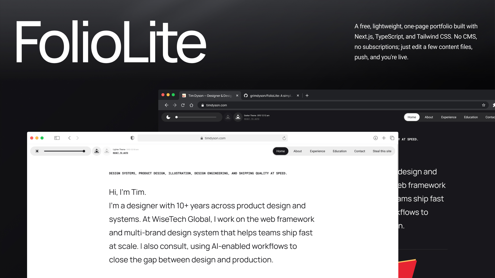

# FolioLite

A free, lightweight, one-page portfolio built with Next.js, TypeScript, and Tailwind CSS. No CMS, no subscriptions — just edit a few content files, push, and you're live.




## Features

- **Single page, section-based layout** — Hero, About, Experience, Education, Contact, and Open Source sections
- **Four adaptive themes** — lighter, light, dark, darker — with a slider in the sticky nav
- **Time-based auto-theming** — theme picks itself based on your local sunrise/sunset on first visit
- **Scroll-reveal animations** — subtle fade + slide inspired by linear.app, with `prefers-reduced-motion` support
- **Sticky navigation** — pills-style nav with a sliding indicator, responsive for mobile and desktop
- **Accessibility out of the box** — skip-to-content link, semantic landmarks, descriptive alt text, focus states, aria labels
- **SEO ready** — Open Graph / Twitter Card meta, JSON-LD structured data, robots.txt, sitemap.xml, canonical URL, favicons + web manifest
- **Zero runtime dependencies** beyond Next.js, React, and Tailwind

## Quick Start

```bash
git clone https://github.com/grimdyson/FolioLite.git
cd FolioLite
npm install
npm run dev
```

Open [http://localhost:3000](http://localhost:3000).

## Make It Yours

### 1. Content

All content lives in plain TypeScript objects — no CMS, no markdown:

| File | What it controls |
|------|-----------------|
| `content/profile.ts` | Tagline, headline, intro, about paragraphs |
| `content/work.ts` | Experience entries + education |
| `content/contact.ts` | Contact links + open source CTA |

Update the data, and the page updates. You shouldn't need to touch layout code.

### 2. Metadata & SEO

These files contain personal info you'll want to replace:

| File | What to update |
|------|---------------|
| `app/layout.tsx` | `metadata` — title, description, Open Graph, Twitter Card, JSON-LD (name, job title, email, social links) |
| `app/robots.ts` | Your domain in the sitemap URL |
| `app/sitemap.ts` | Your domain |
| `public/site.webmanifest` | App name |

### 3. Assets

| File | What to replace |
|------|----------------|
| `public/illustrations/avatar.png` | Your avatar — used to generate favicons and OG image |
| `public/illustrations/v60.svg` | About section illustration |
| `public/illustrations/Banan.svg` | Contact section illustration |
| `public/og-image.png` | Social sharing preview (1200×630) — regenerate from your avatar or replace directly |
| `app/favicon.ico` | 32×32 browser tab icon |
| `app/apple-icon.png` | 180×180 iOS home screen icon |
| `public/icon-192.png` | 192×192 PWA icon |
| `public/icon-512.png` | 512×512 PWA icon |

> **Tip:** If you have [sharp](https://sharp.pixelplumbing.com/) installed (it ships with Next.js), you can regenerate all icons from a new avatar:
> ```bash
> node -e "const s=require('sharp'),a='public/illustrations/avatar.png';s(a).resize(32,32).toFile('app/favicon.ico');s(a).resize(180,180).toFile('app/apple-icon.png');s(a).resize(192,192).toFile('public/icon-192.png');s(a).resize(512,512).toFile('public/icon-512.png');s(a).resize(1200,630,{fit:'contain',background:{r:24,g:24,b:27}}).toFile('public/og-image.png')"
> ```

## Project Structure

```
app/
  layout.tsx          — Root layout, fonts, metadata, theme init script
  page.tsx            — All page sections
  globals.css         — Theme tokens, typography utilities
  robots.ts           — Crawler rules
  sitemap.ts          — Sitemap generation
  favicon.ico         — Browser tab icon
  apple-icon.png      — iOS home screen icon
components/
  StickyChips.tsx     — Sticky nav with pill indicator + theme toolbar
  ThemeToolbar.tsx     — Theme slider (compact, in nav bar)
  ThemeSwitcher.tsx    — Theme slider (standalone, full-width)
  Reveal.tsx          — Scroll-reveal animation wrapper
  Section.tsx         — Section layout with label + border
  Button.tsx          — Styled anchor button
content/              — All page content as TS objects
public/
  illustrations/      — SVG + PNG illustrations
  og-image.png        — Open Graph preview image
  icon-192.png        — PWA icon
  icon-512.png        — PWA icon
  site.webmanifest    — Web app manifest
```

## Theming

Four themes controlled by CSS custom properties on `data-theme`:

- **lighter** — warm off-white
- **light** — neutral light
- **dark** — dark zinc
- **darker** — near-black

On first load, an inline blocking script estimates your local sunrise/sunset and picks a theme. Users can override manually via the slider — the choice persists in localStorage.

Token values live in `app/globals.css` under each `[data-theme="..."]` block.

## Deploy

Built for free-tier Vercel:

```bash
npm run build
```

Push to GitHub, connect to [Vercel](https://vercel.com), and you're live. Update the domain in `app/layout.tsx` (`metadataBase`), `app/robots.ts`, and `app/sitemap.ts` to match yours.

## License

**This is not MIT.** Free for personal use only. You may clone, modify, and deploy this template as your own portfolio. You may **not** resell, redistribute, or repackage it as a product, template, or theme. See [LICENSE](LICENSE) for full terms.
